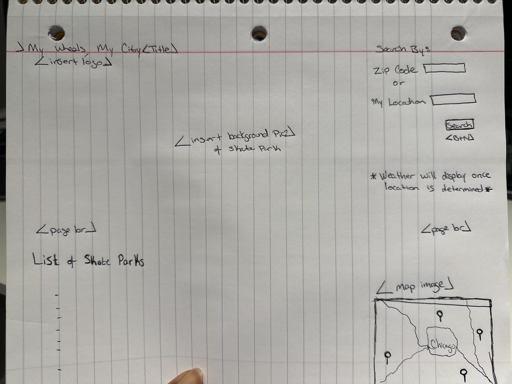

# intelligentsia-group-project-01

## Team name: Intelligentsia

## Project title: My Wheels, My City

## Project description
My Wheels, My City helps people who are interested in wheels with out engines, skaters (quads, inlines), skateboarders, and scooters learn, practice, build community and show off and show out!

## User stories
* As a skater, I want to find skate parks near my location or discover parks that are new to me.
* As a skater who has found a local skate park, I want to be able to input my current zip code (location) and get directions to the park (all forms of transit)
* As someone who wants to go skating, I want to know what the weather at the location of the skate park

## Wireframe

Thanks to Eissa, we have an initial wireframe!

## APIs to be used
* Open Weather
* Google Maps: directions, places
CSS framework: bulma.io CSS framework

## Rough breakdown of tasks
* Nick: Investigate the viability of using google maps to get a list of skate parks
* Eissa: Create a wireframe from the User Stories: layout and function of the page
* Sam: Create examples of how to use bulma.io framework
* Sam: Set up team repository starter code and repo organization
